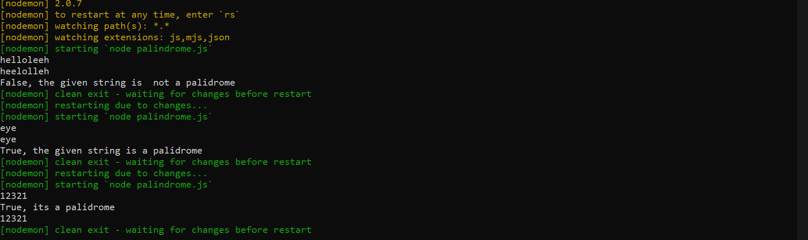
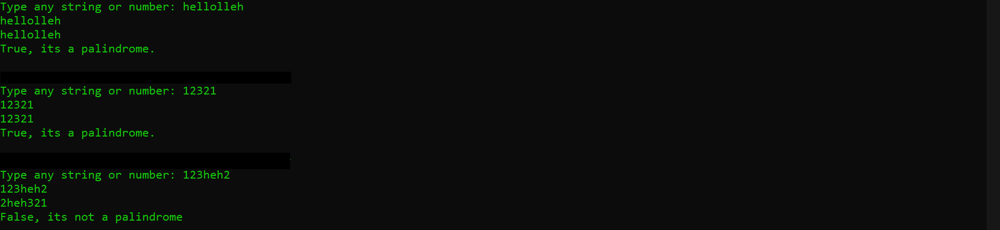

# Palindrome

## Python Program / Javascript Program to Check Palindrome. You can check where an integer or string is a Palindrome or not

## Here are some screen shots

  
   

  

## Editor used 

## Built with 

 
 
 

## License 
### The scripts and documentation in this project are released under the MIT License 

 

## Contributions
### Contributions are welcome! see [Contribution's Guide](https://github.com/Sagar-Sharma-7/Palindrome/blob/main/CONTRIBUTING.md)

 

## Code of Conduct 
 

### Be nice. See our [code of conduct](https://github.com/Sagar-Sharma-7/Palindrome/blob/main/CODE_OF_CONDUCT.md)
